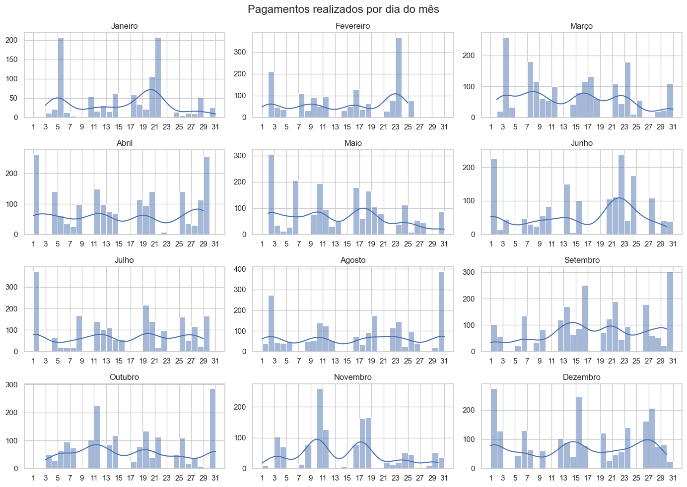

# Analise dos Gastos do Município de Capelinha/MG no Ano de 2022

> "Sem dados você é apenas mais uma pessoa com uma opinião." - W. Edwards Deming

## Município de Capelinha/MG

[Capelinha](https://pt.wikipedia.org/wiki/Capelinha), é um município brasileiro situado no interior do estado de Minas Gerais, Região Sudeste do país. Localiza-se na microrregião denominada Vale do Jequitinhonha. Conforme o censo de 2022, a cidade tem uma população de 39.624 habitantes. Este município exerce uma influência significativa nos campos econômico, educacional, cultural, empresarial e esportivo nos municípios vizinhos, tornando-se a região mais densamente povoada do Vale do Jequitinhonha. A história de Capelinha remonta a 1812, quando a construção da Igreja Matriz de Nossa Senhora da Graça por Feliciano Luiz Pego marcou o início de sua povoação.

## Índice

- [Analise dos Gastos do Município de Capelinha/MG no Ano de 2022](#analise-dos-gastos-do-município-de-capelinhamg-no-ano-de-2022)
  - [Município de Capelinha/MG](#município-de-capelinhamg)
  - [Índice](#índice)
  - [Dados Abertos](#dados-abertos)
    - [Conceito](#conceito)
    - [Legislação](#legislação)
  - [Disclaimer](#disclaimer)
  - [Etapas do Projeto](#etapas-do-projeto)
    - [Análise exploratória dos gastos do município de Capelinha no ano de 2022.](#análise-exploratória-dos-gastos-do-município-de-capelinha-no-ano-de-2022)
  - [Autor](#autor)
  - [License](#license)

## Dados Abertos

### Conceito
Segundo a [Open Knowledge Foundation no Brasil - OKBR](https://ok.org.br), _“dados são abertos quando qualquer pessoa pode livremente *usá-los*, *reutilizá-los* e *redistribuí-los*, estando sujeito a, no máximo, a exigência de creditar a sua autoria e compartilhar pela mesma licença”_. Quando os dados são produzidos, coletados ou custodiados por autoridades públicas e disponibilizados em formato aberto, nesse caso temos dados abertos governamentais. Ainda segundo a OKBR, dados abertos também são pautados por três leis e oito princípios.

As três leis:
- I - Se o dado não pode ser encontrado e indexado na Web, ele não existe;
- II - Se não estiver aberto e disponível em formato compreensível por máquina, ele não pode ser reaproveitado; e
- III - Se algum dispositivo legal não permitir sua replicação, ele não é útil.

Os oito princípios:
1) *Completos*: todos os dados públicos são disponibilizados. Dados são informações eletronicamente gravadas, incluindo, mas não se limitando a, documentos, bancos de dados, transcrições e gravações audiovisuais. Dados públicos são dados que não estão sujeitos a limitações válidas de privacidade, segurança ou controle de acesso, reguladas por estatutos.
2) *Primários*: os dados são publicados na forma coletada na fonte, com a mais fina granularidade possível, e não de forma agregada ou transformada.
3) *Atuais*: os dados são disponibilizados o quão rapidamente seja necessário para preservar o seu valor.
4) *Acessíveis*: os dados são disponibilizados para o público mais amplo possível e para os propósitos mais variados possíveis.
5) *Processáveis por máquina*: os dados são razoavelmente estruturados para possibilitar o seu processamento automatizado.
6) *Acesso não discriminatório*: os dados estão disponíveis a todos, sem que seja necessária identificação ou registro.
7) *Formatos não proprietários*: os dados estão disponíveis em um formato sobre o qual nenhum ente tenha controle exclusivo.
8) *Livres de licenças*: os dados não estão sujeitos a regulações de direitos autorais, marcas, patentes ou segredo industrial. Restrições razoáveis de privacidade, segurança e controle de acesso podem ser permitidas na forma regulada por estatutos.

O objetivo, além da promoção da transparência governamental, é fornecer insumos aos cidadãos e à sociedade civil para serem desenvolvidas ferramentas que proporcionem uma percepção mais efetiva das atividades e dos gastos do governo e contribuam para a melhoria da gestão pública, o estímulo ao controle e participação social, a geração de emprego e renda e o fomento à inovação tecnológica.

No Brasil, conforme o [Manual dos Dados Abertos: Governo](https://www.w3c.br/pub/Materiais/PublicacoesW3C/Manual_Dados_Abertos_WEB.pdf), dados abertos governamentais são particularmente importantes devido à quantidade e centralidade dos dados que coleta e, também, por tais dados serem públicos, um direito garantido no art. 5º da Constituição Federal brasileira.

### Legislação

Abaixo alguns dos dispositivos legais que determinam, direta ou indiretamente, a disponibilização de dados abertos para participação da sociedade no debate das finanças públicas:
- *Lei Complementar n.º 101/2000 (Lei de Responsabilidade Fiscal - LRF)*: determina ao Poder Público a adoção de instrumentos de transparência na gestão fiscal em meios eletrônicos de acesso público às informações orçamentárias e prestações de contas. Disponível em: [https://www.planalto.gov.br/ccivil_03/leis/lcp/lcp101.htm](https://www.planalto.gov.br/ccivil_03/leis/lcp/lcp101.htm)
- *Lei Complementar n.º 131/2009 (Lei da Transparência)*: acrescenta dispositivos à Lei Complementar n.º 101, de 4 de maio de 2000, que estabelece normas de finanças públicas voltadas para a responsabilidade na gestão fiscal e dá outras providências, a fim de determinar a disponibilização, em tempo real, de informações pormenorizadas sobre a execução orçamentária e financeira da União, dos Estados, do Distrito Federal e dos Municípios. Disponível em: [https://www.planalto.gov.br/ccivil_03/leis/LCP/Lcp131.htm](https://www.planalto.gov.br/ccivil_03/leis/LCP/Lcp131.htm)
- *Lei n.º 12.257/2012 (Lei de Acesso à Informação)*: dispõe sobre os procedimentos a serem observados pela União, Estados, Distrito Federal e Municípios, com o fim de garantir o acesso a informações previsto no art. 5º, no inciso II do § 3º do art. 37 e no § 2º do art. 216 da Constituição Federal. Disponível em: [https://www.planalto.gov.br/ccivil_03/_ato2011-2014/2011/lei/l12527.htm](https://www.planalto.gov.br/ccivil_03/_ato2011-2014/2011/lei/l12527.htm)
- *Decreto n.º 7.724 de 16 de maio de 2012*: Regulamenta a Lei no 12.527 (Lei de Acesso à Informação), que dispõe sobre o acesso a informações previsto no inciso XXXIII do caput do art. 5º, no inciso II do § 3º do art. 37 e no § 2º do art. 216 da Constituição Federal. Disponível em: [https://www.planalto.gov.br/ccivil_03/_ato2011-2014/2012/decreto/d7724.htm](https://www.planalto.gov.br/ccivil_03/_ato2011-2014/2012/decreto/d7724.htm)
- *Decreto n.º 10.160 de 09 de dezembro de 2019*: Institui a Política Nacional de Governo Aberto e o Comitê Interministerial de Governo Aberto. Disponível em: [https://www.planalto.gov.br/ccivil_03/_Ato2019-2022/2019/Decreto/D10160.htm](https://www.planalto.gov.br/ccivil_03/_Ato2019-2022/2019/Decreto/D10160.htm)
- *Instrução Normativa INDA n.º 4/2012*: institui a Infraestrutura Nacional de Dados Abertos (Inda). Disponível em: [https://dados.gov.br/pagina/instrucao-normativa-da-inda](https://dados.gov.br/pagina/instrucao-normativa-da-inda)

## Disclaimer

O storytelling empregado neste estudo foi projetada com o intuito de tornar os dados apresentados e o método de elaboração compreensível para qualquer pessoa, independentemente de sua familiaridade com o assunto. Se você já possui conhecimento técnico em Python e/ou Ciência de Dados, sinta-se à vontade para ignorar quaisquer comentários que possam parecer redundantes ou enfadonhos.

## Etapas do Projeto

### [Análise exploratória dos gastos do município de Capelinha no ano de 2022](analise_exploratoria_pagamentos.ipynb).

O foco dessa análise recaiu sobre os gastos públicos do município de Capelinha, situado em Minas Gerais, durante o ano fiscal de 2022. Os resultados obtidos mostraram as principais categorias, funções e órgãos que foram destinatários dos recursos públicos e, além disso, possibilitaram o acompanhamento da evolução dos gastos ao longo do ano, traçando um panorama fiscal que reflete a gestão do município. No âmbito deste estudo, nosso objetivo central foi proporcionar informações úteis, confiáveis e de fácil acesso aos cidadãos e à sociedade civil acerca da gestão fiscal do município de Capelinha, esperando contribuir para a compreensão da aplicação dos recursos na localidade e incentivando o debate público e a atuação cidadã na fiscalização dos gastos públicos.

## Autor

Feito com :heart: por [Alexsander Lopes Camargos](https://github.com/alexcamargos) :wave: Entre em contato!

## License

[MIT License](LICENSE)
